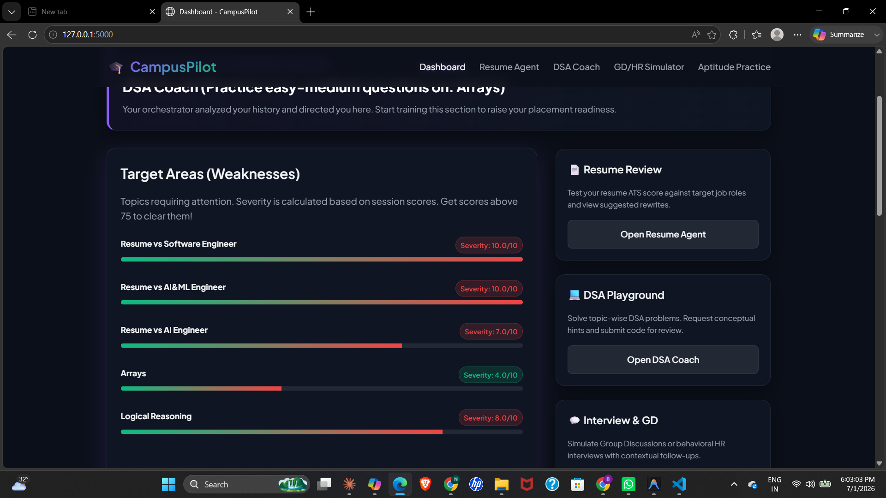

<div align="center">

# 🎓 CampusPilot
### *Your AI-Powered Indian Campus Placement Coach*


> **Built for the 5-Day AI Agents Intensive Vibe Coding Course with Google × Kaggle Capstone**
> Freestyle Track | Solo Submission | July 2026

[Features](#-features) • [Architecture](#-architecture) • [Demo](#-demo-flow) • [Setup](#-setup) • [Security](#-security)

</div>

---

## 🚀 What is CampusPilot?

Most placement prep tools are built for generic, global audiences.
**CampusPilot is different** — it is built specifically around the **Indian campus hiring pipeline**:

```
Aptitude Test → Resume Screening → DSA Round → Group Discussion → HR Interview
```

Every agent, every question bank, every feedback prompt is designed for **Indian engineering freshers** targeting companies like TCS, Infosys, Wipro, Zoho, Flipkart, JP Morgan, and other Indian campus recruiters.

---

## ✨ Features

| Module | What it does |
|--------|-------------|
| 📄 **Resume Agent** | ATS scores your resume against a target role, flags weak sections, suggests AI rewrites |
| 💻 **DSA Coach Agent** | Generates adaptive problems, gives hints (never solutions), evaluates your code |
| 🎤 **GD/HR Simulator** | Live mock GD and HR rounds with contextual follow-ups and scoring |
| 🧠 **Tracker Agent** | Orchestrates all agents, maintains your profile, decides your next focus area |
| 📊 **Dashboard** | Visual severity scores, weak area tracking, session history |
| 📝 **Aptitude Practice** | India-specific quant, logical, and verbal questions (TCS NQT / AMCAT style) |

---

## 🏗 Architecture

CampusPilot implements a **real multi-agent orchestration pattern** — not just multiple API calls, but agents that communicate with each other through an MCP server.

```
┌─────────────────────────────────────────────┐
│               Flask Web UI                  │
│         (Dark Theme, Responsive)            │
└──────────────────┬──────────────────────────┘
                   │
                   ▼
┌──────────────────────────────────────────────┐
│         🧠 Tracker / Orchestrator Agent      │
│   - Maintains student profile & weak areas   │
│   - Decides next focus area after each sess  │
│   - Exposes data layer via MCP Server ──────►│ MCP Tools:
│                                              │  get_weak_areas()
└────────┬──────────┬──────────────┬───────────┘  log_session_result()
         │          │              │               get_next_focus()
         ▼          ▼              ▼
┌────────────┐ ┌──────────┐ ┌─────────────────┐
│📄 Resume   │ │💻 DSA    │ │🎤 GD/HR         │
│  Agent     │ │  Coach   │ │   Simulator     │
│            │ │  Agent   │ │   Agent         │
│Skills:     │ │          │ │                 │
│parse_resume│ │generate_ │ │start_gd_round() │
│score_vs_jd │ │problem() │ │ask_followup()   │
│suggest_    │ │give_hint │ │score_response() │
│rewrite()   │ │evaluate_ │ │                 │
│+ PII Redact│ │solution()│ │                 │
└────────────┘ └──────────┘ └─────────────────┘
```

### Key Design Decisions
- **Tracker Agent is the brain** — it reads results from all 3 agents and decides what the student should focus on next. This cross-agent feedback loop is what makes it a real multi-agent system.
- **MCP Server for data sharing** — agents don't read/write the database directly. They call MCP tools, keeping the data layer decoupled.
- **PII redacted before any LLM call** — resume text has emails, phones, and names stripped locally before anything leaves your machine.

---

## 🎯 The India-Specific Wedge

Generic placement tools won't model the **Indian campus hiring pattern**. CampusPilot does:

- **Aptitude** questions in TCS NQT / Infosys / AMCAT format (quant, logical, verbal)
- **GD topics** common in Indian campus drives ("Is AI a threat to jobs in India?", "Impact of UPI on rural economy")
- **HR questions** for freshers targeting service companies (bond, relocation, why service vs product)
- **Resume scoring** calibrated for Indian company expectations, not Silicon Valley norms

---

## 🧩 Concepts Demonstrated (Capstone Rubric)

| Concept | Implementation |
|---------|---------------|
| ✅ Multi-Agent System | 4 agents (Resume, DSA, GD/HR, Tracker) with cross-agent feedback loop via Tracker orchestration |
| ✅ MCP Server | `tracker_mcp.py` exposes `get_weak_areas`, `log_session_result`, `get_next_focus` as real MCP tools |
| ✅ Agent Skills | Each agent has discrete named skills (e.g. DSA: `generate_problem`, `give_hint`, `evaluate_solution`) |
| ✅ Security | Local PII redaction before LLM calls, API key via env vars, file upload validation |

---

## 🎬 Demo Flow

```
1. Upload resume (PDF)
        ↓
2. Resume Agent: PII redacted locally → ATS score + weak sections returned
        ↓
3. Tracker Agent: logs score via MCP → decides next focus (e.g. "Practice DP problems")
        ↓
4. DSA Coach: generates adaptive problem → student submits code → score logged via MCP
        ↓
5. GD Simulator: live GD round → contextual follow-ups → transcript scored
        ↓
6. Dashboard: Tracker updates severity map → shows recommended next session
```
---
## 📸 Screenshots

### Dashboard — Tracker Agent in Action


### Resume Agent — ATS Scoring (80/100)


### DSA Coach — Adaptive Problem Generation


### GD/HR Simulator — Evaluation Complete (78/100)


---

---

## ⚙️ Setup

### Prerequisites
- Python 3.10+
- Groq API Key (free at [console.groq.com](https://console.groq.com))

### Installation

```bash
# 1. Clone the repo
git clone https://github.com/Niha-868/campuspilot.git
cd campuspilot

# 2. Install dependencies
pip install -r requirements.txt

# 3. Create .env file
echo GROQ_API_KEY=your_key_here > .env

# 4. Run the app
python app.py
```

Open `http://127.0.0.1:5000` in your browser.

### Run the MCP Server (optional standalone)
```bash
python mcp_server/tracker_mcp.py
```

### Run Daily Check-in via CLI
```bash
python scripts/daily_checkin.py
```

---

## 🛡️ Security

See [SECURITY.md](SECURITY.md) for full details.

| Measure | Details |
|---------|---------|
| PII Redaction | Emails, phones, names stripped via regex before any LLM call |
| API Key Safety | Loaded from `.env` only, never logged or shown in UI |
| File Validation | PDF only, 5MB max, temp files deleted after parsing |
| .gitignore | `.env`, `*.key`, `student_profiles.json` excluded from git |

---

## 📁 Project Structure

```
campuspilot/
├── agents/
│   ├── resume_agent.py       # ATS scoring + PII redaction
│   ├── dsa_agent.py          # Problem generation + evaluation
│   ├── interview_agent.py    # GD/HR simulation + scoring
│   └── tracker_agent.py      # Orchestrator + MCP client
├── mcp_server/
│   └── tracker_mcp.py        # MCP server exposing 3 tools
├── data/
│   ├── seed_questions.json   # India-specific question bank
│   └── student_profiles.json # Student progress store
├── templates/                # Flask HTML templates
├── static/                   # CSS + JS
├── scripts/
│   └── daily_checkin.py      # CLI automation script
├── app.py                    # Flask app + route wiring
├── README.md
├── SECURITY.md
└── requirements.txt
```

---

## 👩‍💻 Author

**Niharika** | B.Tech CSE (AI & ML) | Raghu Engineering College, Visakhapatnam
GitHub: [@Niha-868](https://github.com/Niha-868)

---

## 📜 License

MIT License — free to use, fork, and build on.

---

<div align="center">
Built with 🤖 Groq (LLaMA 3.3 70B) + 🐍 Flask + 🔗 MCP + ❤️ for Indian freshers

*CampusPilot — because placement prep should know where you're from.*
</div>
